  <!-- Animated AI thinking banner -->
  

 

  <h1>Hi 👋, I'm Vivek Joy</h1>
  <h3>🚀 AI Engineer | Computer Vision | Deep Learning Enthusiast</h3>
  
  

    Passionate about building real-time AI applications that solve real-world problems. Specialized in deploying optimized computer vision models on edge devices and managing end-to-end MLOps pipelines.
  

  <!-- Social Badges -->
  
  
  

---

## 🛠 Tech Stack

  
  
  
  
  
   
  
  
  
  

---

## 🔥 Featured Projects

### 🚀 [RF-DETR-Spill-Detection](https://github.com/vivek97vivu/RF-DETR-Spill-Detection)
*Real-time fluid/oil spill detection leveraging RF-DETR architecture.*
- **Model**: RF-DETR trained on customized industrial spill datasets.
- **Tech Stack**: PyTorch, Python, OpenCV, Roboflow.
- **Performance**: High precision detection with real-time alerting system for compliance.

### 🚀 [Fire-Smoke-Detection](https://github.com/vivek97vivu/Fire-Smoke-Detection)
*High-accuracy hazard detection systems for industrial safety.*
- **Model**: Custom YOLOv8 / YOLOv11 detectors.
- **Tech Stack**: PyTorch, OpenCV, CUDA.
- **Features**: Early smoke & fire detection in varying illumination conditions.

### 🚀 [YOLO-PPE-Detection](https://github.com/vivek97vivu/YOLO-PPE-Detection)
*Automated personal protective equipment compliance system.*
- **Model**: YOLOv8-based multi-class detector (Helmets, Vests, Gloves).
- **Tech Stack**: PyTorch, Python, CUDA.
- **Goal**: Real-time worker safety monitoring in manufacturing environments.

### 🚀 [MLflow-DVC-Pipeline](https://github.com/vivek97vivu/MLflow-DVC-Pipeline)
*Production-ready machine learning operations framework.*
- **Purpose**: Experiment tracking and dataset version control.
- **Tech Stack**: MLflow, DVC, Git, Python.
- **Highlights**: Full reproducibility, data version lineage, and centralized model registry.

---

## 📊 GitHub Analytics & Trophies

  

 

  
  

 

  

---

## 🐍 Contribution Snake

  

