<!-- Two-column header layout -->
<table border="0" cellpadding="0" cellspacing="0" width="100%">
  <tr valign="middle">
    <td width="55%" align="left" style="border: none;">
      <h1>Hi 👋, I'm Vivek Joy</h1>
      <h3>Data Scientist | VLM &amp; LLM Specialist | AI/ML Edge Engineer</h3>
      

        Results-driven Data Scientist &amp; Edge AI Engineer with 4+ years of experience designing and deploying predictive models, VLMs/LLMs, and computer vision systems on NVIDIA Jetson &amp; ARM edge devices. Specialized in edge optimizations (TensorRT, CUDA, model quantization), RAG pipelines, and scalable statistical analysis workflows.
      

       
      <!-- Social Badges -->
      
      &nbsp;
      
      &nbsp;
      
    </td>
    <td width="45%" align="right" style="border: none;">
      
    </td>
  </tr>
</table>

 

<!-- Tech Stack Section -->
## 🛠 Tech Stack

### 📊 Data Science, Statistics & Analytics
&nbsp;
&nbsp;
&nbsp;
&nbsp;
&nbsp;
&nbsp;
&nbsp;

### 🧠 GenAI, VLM & LLM
&nbsp;
&nbsp;
&nbsp;
&nbsp;

### 🔥 Edge AI & Computer Vision
&nbsp;
&nbsp;
&nbsp;
&nbsp;
&nbsp;
&nbsp;
&nbsp;
&nbsp;
&nbsp;
&nbsp;

 

<!-- Pinned Repositories Section -->
## 🚀 Pinned Repositories

<table border="0" cellpadding="0" cellspacing="0" width="100%">
  <tr>
    <td width="50%" style="border: none; padding: 5px;">
      
    </td>
    <td width="50%" style="border: none; padding: 5px;">
      
    </td>
  </tr>
  <tr>
    <td width="50%" style="border: none; padding: 5px;">
      
    </td>
    <td width="50%" style="border: none; padding: 5px;">
      
    </td>
  </tr>
  <tr>
    <td width="50%" style="border: none; padding: 5px;">
      
    </td>
    <td width="50%" style="border: none; padding: 5px;">
      
    </td>
  </tr>
</table>

 

<!-- Stats and Analytics Section -->
## 📊 GitHub Analytics

<table border="0" cellpadding="0" cellspacing="0" width="100%">
  <tr valign="top">
    <td width="33%" style="border: none; padding: 5px;">
      
    </td>
    <td width="33%" style="border: none; padding: 5px;">
      
    </td>
    <td width="34%" style="border: none; padding: 5px;">
      
    </td>
  </tr>
</table>

 

<!-- Contribution Graph Section -->
## 📅 Contribution Graph

  

 

<!-- Recent Activity Section -->
## 🔔 Recent Activity

<!--START_SECTION:activity-->
* 🚀 Pushed to **rf-detr-spill-detection** 2 hours ago
  * `a1b2c3d` Update README and results
<!--END_SECTION:activity-->
